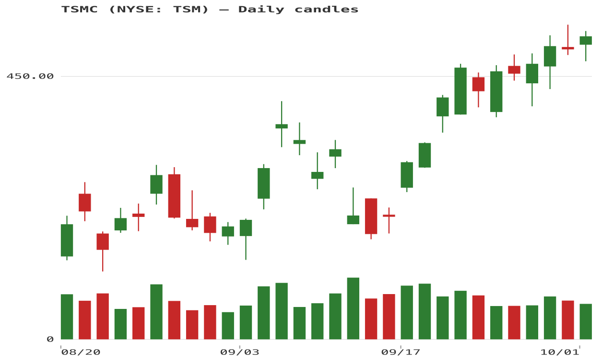
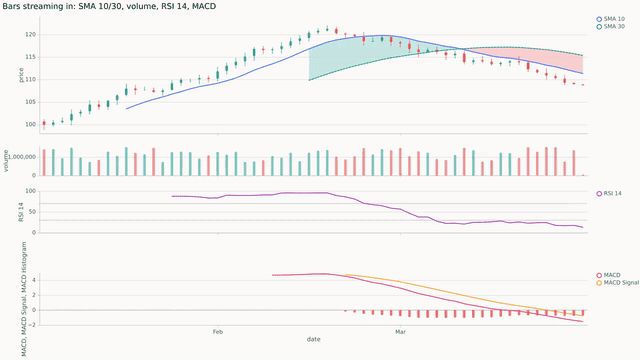
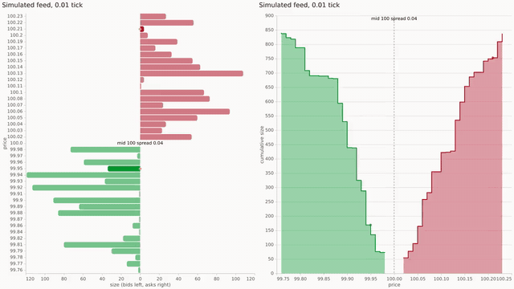

# financial-charts.el

The Emacs package is `financial-chart` (files and functions are
`financial-chart-*`); this repository is financial-charts.el.

Financial charts in Emacs from data you supply. financial-chart never
fetches anything: you hand it plain Lisp data (or JSON through eas's
shell door), it validates that data strictly and draws it however you
declare, through the [eas.el](https://github.com/davidawad/eas.el) chart
engine. One call draws any chart kind (candlesticks, area, line,
sparkline, option payoff, diverging P/L bars, depth, heatmap, ...) as
text in a terminal frame or as an SVG image in a GUI frame. Pure Elisp;
the only external process is optional PNG export.



[See the indicator chart samples](docs/indicator-examples.md).

[Watch the animated charts](docs/videos/README.md): a live order book
(ladder, depth, both, and in a terminal) and candles with indicators
updating as bars stream in.

Daily NYSE: TSM candles, August 20–October 1, 2026. [Source data](examples/tsmc-daily.csv)
and [regeneration script](src/examples/render-tsmc-chart.el); source: [Nasdaq historical
data](https://api.nasdaq.com/api/quote/TSM/historical?assetclass=stocks&fromdate=2026-08-01&todate=2026-10-02&limit=30).

Requires Emacs 30.1+ and [eas.el](https://github.com/davidawad/eas.el).
Data comes from you: a broker package, a CSV, a tool's JSON. See
"Bringing data from other packages".

## Install

With Emacs 30's `use-package :vc`:

```elisp
(use-package financial-chart
  :vc (:url "https://github.com/davidawad/financial-charts.el" :lisp-dir "src"))
```

or add eas.el's and this repository's `src/` directories to `load-path` and
`(require 'financial-chart)`.

On MELPA the package is `financial-charts` (recipe in `recipes/financial-charts`);
it installs flat, every `src/` module beside `templates/` and the `examples/`
JSON the templates and examples read, and finds them there as it does in a
checkout (`financial-chart-root`).

## Use

```elisp
;; a string: SVG in a GUI frame, unicode text in a terminal
(financial-chart-plot 'area '((1 40.0) (2 45.0) (3 50.0) (4 42.0)) :unit "$")

;; at point, or in a buffer (g re-renders to the window, t flips text/SVG)
(financial-chart-plot-insert 'payoff '((90 50) (95 0) (100 -100) (105 0) (110 50)))
(financial-chart-plot-view 'bars '(("AAPL" . 1200) ("VTI" . 8000) ("TSLA" . -950))
                           :title "open P/L" :unit "$")

;; candlesticks with a volume pane (overlays: financial-chart-indicators)
(financial-chart-plot-view 'ohlc
  '((:open 100 :high 103 :low 99 :close 102 :volume 12000 :time 1700000000000)
    (:open 102 :high 104 :low 101 :close 101.5 :volume 9500 :time 1700086400000)))

;; every kind over sample data
(financial-chart-demo)
```

| Kind | What it draws | Data shape |
|---|---|---|
| `area`, `line`, `sparkline` | price or value history; numeric X is spaced by value, epoch-ms X gets a date axis, `:scale 'log` | series: numbers, `(X Y)` or `(X . Y)`, oldest first |
| `ohlc` | candlesticks with volume pane, indicator overlays and oscillator panes (RSI) | `(:open :high :low :close [:volume] [:time])` plists, `:time` in epoch ms |
| `multi` | several named series on one scale, `:normalize 100` to rebase (ticker vs benchmark) | `(("AAPL" . SERIES) ("SPY" . SERIES))` |
| `payoff` | option P/L vs price with breakevens | `(PRICE PNL)` sorted by price |
| `payoff-curves` | T+n payoff curves on one price grid | `(("T+0" . PAYOFF) ("T+30" . PAYOFF))` |
| `bars` | diverging bars, e.g. P/L per position | `(LABEL . VALUE)` |
| `drawdown` | running % decline from the high-water mark, max drawdown | series (equity or price) |
| `histogram` | distribution of period returns, mean and stdev (`:bins`) | series |
| `depth` | cumulative bid/ask order-book depth | `(:bids ((P S) ...) :asks ((P S) ...))` |
| `heatmap` | labeled matrix, e.g. correlations, diverging colors | `(:labels (...) :rows ((...) ...))` |
| `volume-profile` | volume by price level with point of control | ohlc |

`(financial-chart-list-kinds)` lists them with docs;
`(financial-chart-describe-kind 'KIND)` shows a kind's data shape and example.

Every kind is drawn by an eas template (`financial-chart-describe-kind`
names it), so text and SVG share one layout, hover tooltips and the
datum behind each cell. Oscillators such as RSI draw in their own pane
under the candles (`financial-chart-oscillators`, or a cohort that
contains them).

Common props: `:backend` (`text`, `svg`, `auto`; default
`financial-chart-backend`), `:width`/`:height` (text columns/rows),
`:pixel-width`/`:pixel-height` (SVG), `:unit`, `:title`, `:font` (SVG
font family) and `:scale 'log` for area and line. A chart is also plain
data, `(:kind area :data ... :unit "$")`, which `financial-chart-plot-spec`
renders.

### The chart buffer

`financial-chart-plot-view` shows a chart in a `financial-chart-plot-mode`
buffer: `g` re-renders to the window, `t` flips text/SVG, `+`/`-` zoom a
series around point or the latest data and `0` resets, and moving point
over a text chart shows that datum's tooltip in the echo area. Pass
`:refresh-fn` (returns fresh data) and `:refresh-interval` (seconds) for a
live chart; `r` toggles the timer.

## For programs and agents

Every part of the package can be listed, checked and planned before
anything is drawn:

```elisp
(financial-chart-list-kinds)            ; kinds with shape, template and doc
(financial-chart-describe-kind 'payoff) ; shape doc, example data, its eas template
(financial-chart-validate 'payoff data) ; t, or financial-chart-invalid-data
(financial-chart-check 'payoff data)    ; t, or (:code :index :field :message)
(financial-chart-explain 'area data :backend 'svg) ; template, backend and why, args; draws nothing
(financial-chart-describe)              ; the whole package as JSON-ready data
(financial-chart-doctor)                ; M-x: does every kind render here, at parity?
(financial-chart-register-kind 'my-kind :shape 'series :template "my-template"
                               :adapter "series" :doc "...")
```

Errors are typed (`financial-chart-unknown-kind`,
`financial-chart-invalid-data`, parent `financial-chart-error`); their
message says what to do and their data is `(MESSAGE :code CODE :index
INDEX :field FIELD)`, naming the offending row and field
(`financial-chart-error-data` returns it as a plist). SVG output
carries a `<title>` and a `<desc>` stating the kind, point count and
value range.

### Validation

Nothing is drawn until the data passes its shape's validator. Codes:

| Shape | Checked | Codes |
|---|---|---|
| bar/v1 (`ohlc`, `volume-profile`) | a list of plists with finite `:open :high :low :close`; high >= max(open, close) >= min(open, close) >= low; `:volume` non-negative; `:time` (epoch ms) on every bar or none, strictly increasing | `not_a_list`, `not_a_plist`, `missing_field`, `not_a_number`, `high_below_body`, `low_above_body`, `negative_volume`, `time_not_increasing` |
| indicators | every overlay and oscillator `:fn` returns one number-or-nil per bar; indicator-series/v1 `:timestamps` equal the bars' `:time` (`financial-chart-validate-indicator-series`) | `indicator_length`, `indicator_misaligned`, `not_a_number` |
| series | numbers, `(X Y)` or `(X . Y)` with finite Y (nil Y skips a point); `:scale 'log` needs Y > 0 | `invalid_point`, `not_a_number`, `nonpositive_log` |
| payoff | numeric `(PRICE PNL)`, ascending price | `not_a_number`, `price_not_ascending` |
| labeled | `(LABEL . NUMBER)` | `invalid_label`, `not_a_number` |
| order-book | `:bids`/`:asks` of positive `(PRICE SIZE)`, best bid <= best ask | `not_an_order_book`, `invalid_level`, `not_positive`, `crossed_book` |
| matrix | one numeric row per label, rectangular | `not_a_matrix`, `row_count`, `column_count`, `not_a_number` |
| multi-series, payoff-curves | each entry as its inner shape (nested rows read `series[2].y`), payoff curves on one price grid | the inner codes, `zero_base`, `grid_mismatch` |

Drawdown and histogram also check their math (`negative_price`,
`nonpositive_start`, `zero_price`). Data handed to eas's adapters (the
shell door) fails as eas's `SHAPE_INVALID` with the same `index` and
`field`.

## Charts from the shell

The shell door is eas.el's `bin/eas` with this package's templates
registered. `bin/eas` alone does not load them (it has no templates flag
or env var), so run the same entry point with `financial-chart-eas`
loaded first. Put it in a shell function:

```sh
EAS=~/projects/Personal/emacs/eas.el   # your eas.el checkout
FC=~/projects/Investing/financial-chart.el
fc-eas() {
  emacs -Q --batch -L "$EAS/src" -L "$FC/src" -l financial-chart -l financial-chart-eas \
    -l eas-agent-cli -f eas-agent-cli-main -- "$@"
}

fc-eas describe templates                     # ohlc, panes, payoff, depth, ... plus eas's own
fc-eas example ohlc --raw > bars.json         # bindings that render as-is
fc-eas render ohlc --data bars.json --backend text --raw          # candlesticks as text
fc-eas render ohlc --data bars.json --backend svg --raw > ohlc.svg
fc-eas check payoff --data payoff.json        # validate before drawing
```

`bars.json` is `{"bars": [{"time": "2026-08-20", "open": ..., "high": ..., "low": ...,
"close": ..., "volume": ...}, ...]}`. Every verb answers a `chart/v1`
envelope and exits 1 on failure; `--raw` prints only the data. The
`indicators` and `oscillators` bindings of `ohlc` need `financial-chart-eas`
loaded, which the function above does. The verbs and options are
documented in eas.el's README and `bin/eas describe verbs`.

## Composed charts: price styles, overlays and panes

`financial-chart-compose` takes one declarative chart description (JSON,
or the same plist) and compiles it to a single plain eas spec with the
bars and every derived series inline. The package supplies no data: you
pass the bars, it checks them, computes indicators from them and draws
what you declare.

```json
{"title": "TSM daily",
 "bars": [{"time": "2026-08-20", "open": 408.6, "high": 417.96, "low": 407.72,
           "close": 416.0, "volume": 10447900}, ...],
 "colors": {"up": "#26a69a", "down": "#ef5350"},
 "price": {"style": "candles",
           "series": [{"indicator": "sma", "params": [20]},
                      {"indicator": "sma", "params": [50], "dash": [4, 2]}],
           "fills": [{"between": ["sma-20", "sma-50"],
                      "above": "#26a69a", "below": "#ef5350"}]},
 "panes": [{"volume": true},
           {"series": [{"indicator": "rsi", "params": [14]}], "rules": [30, 70],
            "fills": [{"between": ["rsi-14", 70], "color": "#ef5350"}]},
           {"series": [{"indicator": "macd", "output": "macd"},
                       {"indicator": "macd", "output": "macd-signal"},
                       {"indicator": "macd", "output": "macd-histogram",
                        "above": "#26a69a", "below": "#ef5350"}]}]}
```

- **Price styles** (`price.style`): `candles` (filled), `hollow` (rising
  bodies outlined), `heikin-ashi` (computed from the bars), `ohlc` (bars
  with open/close ticks), `line`, `step`, `area` (mountain) and
  `baseline` (`baseline` level, default the first close, filled `above`
  and `below` it). Line styles take `field`, `color`, `width`, `dash`.
- **Series** (`series` of the price pane or any pane): `"sma"`,
  `{"indicator", "params", "output"}` (any registered indicator; a
  multi-output one without `output` gives one series per output),
  `{"values": [...], "label"}` (one value or null per bar) or
  `{"field": "high"}`. Each takes `id`, `label`, `color`, `width`, `dash`
  and `style` (`line`, `step`, `histogram`, `area`, `dots`); histograms
  take `above`/`below` colours by sign. Ids default to the indicator and
  its parameters (`sma-20`); an output adds `.OUTPUT`
  (`bollinger-bands-20-2.bollinger-upper`).
- **Fills** (`fills`): `{"between": [A, B], "color"}` shades between two
  series, bar fields or numbers; with `above` and `below` instead, the
  fill switches colour exactly where A crosses B (crossings are
  interpolated). `opacity` defaults to 0.2.
- **Panes** (`panes`): each is `{series, fills, rules, volume, title,
  domain, height, id}`; `rules` are levels (`[30, 70]` or
  `{"y", "color", "dash", "width"}`), `domain` fixes the y range (an
  oscillator with bounds, such as RSI, gets them by default),
  `"volume": true` draws up/down-coloured volume bars. All panes share
  the x axis, one crosshair and one zoom; only the bottom one labels
  dates.
- **Trading time** (`x`, default `"trading"`): bars with times sit one
  slot apart on the x axis, so weekends, holidays and overnight hours
  leave no gaps between candles. The axis still reads as dates: ticks
  fall on the bars that open a new half hour, hour, day, week, month,
  quarter or year, the finest unit giving at most 8 ticks (`{"scale":
  "trading", "ticks": N}` changes the cap); a new year is labelled with
  the year. The rows carry the bar's slot as `time` and its date as
  `date` (the crosshair reads the date). `"x": "calendar"` keeps
  calendar time, gaps and all (`examples/compose/calendar.json`). Bars
  without times are always on their indices.
- **Colours**: each indicator has a home colour in
  `financial-chart-palette` (SMA blue, EMA orange, RSI purple, ...), the
  same in every pane and chart; a repeat (SMA 20 then SMA 50) takes the
  next colour no other series uses. `colors.up`/`colors.down` (or
  `financial-chart-palette-up`/`-down`) colour candles, volume and
  baseline fills.

```elisp
(financial-chart-compose CHART)                     ; the eas spec (plist)
(financial-chart-compose-render CHART :backend 'text :width 100 :height 30)
(financial-chart-compose-render "chart.json" :backend 'svg :width 800 :height 500)
(financial-chart-compose-describe)                  ; styles, forms, palette, indicators
(financial-chart-compose-example "heikin-ashi")     ; examples/compose/STYLE.json
```

A bad description signals `financial-chart-invalid-chart` with `:code`
(`UNKNOWN_STYLE`, `UNKNOWN_INDICATOR`, `UNKNOWN_SERIES`,
`LENGTH_MISMATCH`, `INVALID_BAR`, `INVALID_X`, ...) and the JSON `:path` of the
offending entry. From the shell, compile and hand the spec to eas:

```sh
fc-compose() {
  emacs -Q --batch -L "$EAS/src" -L "$FC/src" -L "$FC/src/core" -L "$FC/src/indicators" \
    -L "$FC/src/renderers" -L "$FC/src/charts" -L "$FC/src/integrations" \
    -l financial-chart -f financial-chart-compose-main -- "$@"
}
fc-compose examples/compose/candles.json > candles.vl.json   # plain eas spec
$EAS/bin/eas render candles.vl.json --backend text --raw
fc-compose examples/compose/ohlc.json --backend svg --width 800 --height 500 > ohlc.svg
```

A failure prints `{"ok": false, "reason", "message", "path"}` on stderr
and exits 1. `examples/compose/` has one description per style
(regenerate with `src/examples/render-compose-examples.el`); their text
and SVG renderings are goldens in `test/golden/compose/`.



A composed chart redrawn as bars stream in, indicators recomputed each
frame ([MP4](docs/videos/candles.mp4); the same
[in a terminal](docs/videos/candles-text.mp4)).

## Live order books: ladder and depth from deltas

Send the book once, then stream deltas. financial-chart keeps the book,
applies each delta batch and pushes frames through eas streaming. Frames
are capped and pause while the pointer is over the chart. Two templates
draw a book: `ladder` (bids left and asks right of a price spine, with a
spread row) and `depth-live` (cumulative step areas with the mid ruled).
Both show the mid and the spread and flash levels that just changed.

```elisp
(require 'financial-chart-eas-book)
(setq view (financial-chart-book-open
            (eas-json-read-file "examples/order-book/book.json")
            :template "ladder" :levels 20 :flash 0.6 :show t))
(financial-chart-book-push view
  [(:op "update" :side "bid" :price 100.9375 :size 3.5)
   (:op "insert" :side "ask" :price 101.03125 :size 1)
   (:op "delete" :side "ask" :price 101.5)
   (:side "bid" :price 100.5625 :size 0)])   ; no op: size 0 deletes, else sets
(financial-chart-book-inspect view)          ; best bid/ask, mid, spread, stream state
(financial-chart-book-reset view SNAPSHOT)   ; resync after a gap in the feed
```

Each batch is atomic. An insert of an existing level (`DUPLICATE_LEVEL`),
an update or delete of a missing one (`UNKNOWN_LEVEL`), a malformed
delta (`INVALID_DELTA`) or a batch that crosses the book
(`CROSSED_BOOK`) signals `financial-chart-invalid-book` with `:code`,
`:index` and `:path`, and the book is left unchanged. The frame cap
follows the depth: 10 fps up to 50 levels per side, 8 up to 100, and 5
beyond that. `docs/design/order-book.md` has the design and the measured
frame costs. `examples/order-book/` holds a book, a delta batch and the
rows both templates render (`fc-eas example ladder`).

Prices are labelled to the book's tick: `:tick` in the snapshot or on
`financial-chart-book-open` fixes it, otherwise it is the smallest step
between the book's prices, and labels carry as many decimals as its
prices need. A feed that computes its prices (`100.95 - 0.1 * i`) shows
`102.15`, not `102.14999999999999`, on every ladder level, tooltip,
mid and spread (depth-live's price axis ticks are the scale's own round
values). Incoming prices are rounded to 12 significant digits, so a
delta priced `102.15` finds the snapshot's `102.14999999999999` level.
`financial-chart-book-inspect` reports the `:tick` and `:decimals` in use.



Ladder and depth-live on one seeded feed
([MP4](docs/videos/book-pair.mp4); the ladder
[in a terminal](docs/videos/book-text.mp4)). `scripts/record-videos`
records these clips; `docs/videos/README.md` says how.

## Indicator catalog: studies, zones and annotations

Every common indicator is one word in a composed chart. The math runs on
the bars you supply (nothing is fetched); a study expands into the plain
DSL above (series, fills, rules, zones), so it adds nothing you could
not write by hand, and the result is one plain eas spec.

```json
{"bars": [...],
 "price": {"style": "candles",
           "studies": ["ichimoku", {"study": "bollinger", "params": [20, 2]}],
           "annotations": [{"type": "buy", "at": "2026-05-26", "label": "buy"},
                           {"type": "level", "y": 127.3, "label": "resistance"},
                           {"type": "fibonacci"}]},
 "panes": [{"study": "volume", "height": 50},
           {"study": "rsi", "levels": [80, 20]},
           {"study": "macd"},
           {"series": ["cci"], "zones": [{"from": -100, "to": 100}]}]}
```

- **Overlays** (`price.studies`): `ichimoku` (tenkan, kijun, chikou 26
  bars back, senkou A/B 26 bars past the last bar with the cloud
  coloured by which span leads), `bollinger`, `keltner`, `donchian`,
  `envelopes` (bands with the channel shaded), `vwap-bands` (VWAP with
  1 and 2 deviation bands), `pivots` (`classic`, `fibonacci`, `woodie`
  or `camarilla` from the previous `day`, `week`, `month`, `year` or N
  bars), `supertrend` (the trailing stop in the trend's colour), `psar`
  (dots up-coloured under price, down-coloured over it) and `ma-ribbon`
  (`["ema", 10, 20, ...]`, a colour ramp).
- **Oscillator panes** (`{"study": NAME}` is a pane; `studies` puts
  several in one): `rsi` (70/30), `stochastic` (80/20), `cci` (±100),
  `williams-r` (-20/-80), `mfi` (80/20), `ultimate-oscillator` (70/30)
  each with its reference levels, the zone between them and the
  overbought/oversold excursions filled; `macd` (line, signal and an
  up/down histogram on a zero rule), `adx` (ADX, +DI up-coloured, -DI
  down-coloured, a 25 rule), `aroon`, `obv`, `atr`, `roc`, `momentum`,
  `cmf` and `volume`.
- A study takes `params` (the indicator's), `id` (its series are
  `ID.PART`: `bollinger.upper`, `ichimoku.senkou-a`; the default id is
  the name and params), `levels` (`[upper, lower]`) and `values`
  (`{"upper": [...], "lower": [...]}`, or `{"value": [...]}` for a
  one-line study: your own series, one value or null per bar, drawn in
  the study's colours, fills and shift instead of computed ones). The
  pane's own `series`, `fills`, `rules`, `title` and `height` still
  apply.
- **Zones** (`zones` of any pane): `{"from", "to", "color", "opacity"}`
  shades a band between two levels. A two-colour fill may leave a side
  unshaded with `"above": "none"` or `"below": "none"`.
- **Shift**: any series takes `"shift": N` bars (negative draws it
  earlier). A forward shift grows the chart by N bar slots past its last
  bar, dated at the bar spacing (weekdays for daily bars that skip
  weekends) for the axis labels and annotations.
- **Annotations** (`annotations` of any pane), each with a `type`:
  `buy`/`sell` (arrows under the low or over the high of the bar `at`,
  one time or an array; `y` places them), `level` (`y`, optional
  `from`/`to`), `trendline` (`from` and `to` as `[AT, Y]`, `extend`
  `right`, `left` or `both`), `event` (a vertical rule at `at`, its
  `label` at the top), `text` (`label` at `at`, `y`), `box` (`from`,
  `to`) and `fibonacci` (retracement levels of `from`→`to`, by default
  the swing between the highest high and lowest low of the bars or the
  last `window` bars; `levels` are the ratios). Off the price pane,
  markers need `y` and Fibonacci `from` and `to`. All take `label`,
  `color`, `dash`, `width`. `at` is a bar time (ISO date or epoch ms),
  or a bar index when the bars have no times. On trading time a date
  with no bar (a weekend, a holiday) lands on the nearest bar; one
  outside the bars and their shifted slots is `NO_SUCH_BAR`.

`(financial-chart-compose-describe)` lists the catalog (`:studies`,
`:annotations`). `examples/indicators/` has one chart per study plus
`markers`, `annotations` and `fibonacci` (regenerate with
`src/examples/render-indicator-catalog.el`); their text renderings, and
SVG for eight of them, are goldens in `test/golden/indicators/`.

```elisp
(financial-chart-catalog-example "ichimoku")      ; examples/indicators/NAME.json
(financial-chart-compose-render (financial-chart-catalog-example "rsi") :backend 'text)
```

```sh
fc-compose examples/indicators/ichimoku.json --backend text --cols 100 --rows 34
```

Failures carry `:code` and the JSON `:path`: `UNKNOWN_STUDY`,
`STUDY_MISPLACED` (an oscillator in the price pane or the reverse),
`INVALID_STUDY`, `INDICATOR_FAILED` (bad `params`), `INVALID_ZONE`,
`INVALID_SHIFT`, `UNKNOWN_ANNOTATION`, `INVALID_ANNOTATION`,
`NO_SUCH_BAR` (a marker's `at` names no bar) and `INVALID_TIME`.

## Candlesticks

`financial-chart-render` (text), `financial-chart-render-svg` and
`financial-chart-view` take a list of bar/v1 plists directly; they are
the `ohlc` kind drawn by eas's `ohlc` template. `let`-bind a defcustom
for a one-off override.

### Configuration

All `financial-chart-*` custom variables (`M-x customize-group
financial-chart`):

- `financial-chart-height` — text rows of `financial-chart-render` (default 20).
- `financial-chart-max-bars` — window to the most recent N bars (default
  80; nil/0 = unlimited).
- `financial-chart-show-volume` — draw the volume pane (default t; only
  when at least one bar has `:volume`).
- `financial-chart-indicators` — overlays on the price pane, a list of
  plists `(:fn FN :label LABEL)`. `FN` takes the (already-windowed) bars
  and returns one number-or-nil per bar on the price scale; a result of
  any other length is a validation error.
- `financial-chart-oscillators` — the same shape, each drawn in its own
  pane under the price pane.

```elisp
(setq financial-chart-indicators
      (list (list :fn (lambda (bars) (financial-chart-sma bars 20)) :label "SMA 20")))
```

Colors, fonts, axes and glyphs are eas's (its theme follows yours).

### Provider-neutral indicator series

The calculation boundary is normalized `bar/v1` input and
`indicator-series/v1` output. Indicator functions have no broker
dependency. Any provider or external calculator can return the same
series shape: aligned `:values` (numbers or `nil`), optional epoch-ms
`:timestamps`, plus `:name`, `:label`, `:unit`, `:panel`, `:scale`,
`:bounds`, `:params` and `:source` metadata.

```elisp
;; Compute locally from normalized bars; output retains the bar timestamps.
(setq rsi (financial-chart-indicator-evaluate 'rsi bars 14))

;; Or normalize a result computed by another library or service.
(setq vendor-rsi
      (financial-chart-normalize-indicator-series
       '(:name vendor.rsi-14 :label "RSI 14" :unit :percent
         :panel :oscillator :values [nil 42.1 55.8]
         :timestamps [1728000000000 1728086400000 1728172800000]
         :source vendor)))

;; Any normalized result is directly plottable as a line series.
(financial-chart-plot-spec (financial-chart-indicator-chart-spec vendor-rsi))
```

`financial-chart-register-indicator` adds a local calculator to the
registry. `financial-chart-list-indicators` reports its display
metadata. Multi-output indicators (for example, a MACD line, signal
line and histogram) return a list of named series with the same
timestamps. The built-ins favor simple, inspectable pure-Elisp
calculations for ordinary chart windows; expensive or specialized
calculations can be supplied externally through `indicator-series/v1`.

### Built-in indicators

- `financial-chart-indicator-evaluate` exposes the built-ins through one
  registry. Call `financial-chart-list-indicators` to discover them:
  moving averages (SMA, EMA, WMA, DEMA, TEMA, HMA, KAMA); momentum and
  oscillators (Momentum, ROC, CCI, MACD, RSI, Stochastic, Williams %R,
  Ultimate Oscillator); volatility and range (ATR, Bollinger Bands,
  Keltner Channels, Donchian Channels); trend (DMI/ADX, Aroon, Parabolic
  SAR); and volume flow (OBV, A/D, MFI, CMF, Chaikin Oscillator).
  Parameterized functions use documented period defaults. Warm-up and
  unavailable points remain `nil`, preserving alignment with input bars.
- [Indicator examples](docs/indicator-examples.md) shows eight rendered
  TSMC charts and includes the script to regenerate their PNG captures.
- `financial-chart-sma`/`-ema` `(bars &optional window field)` — moving
  average of `:close` (or `FIELD`) over `WINDOW` bars (default 20). On
  the price scale — use directly as a `financial-chart-indicators` `:fn`.
- `financial-chart-vwap` `(bars)` — cumulative volume-weighted average
  price (typical price × volume). Also on the price scale, also a
  direct `:fn`. VWAP conventionally resets daily — pass one session's
  bars, not a multi-day history, unless you deliberately want a running
  VWAP across the whole window.
- `financial-chart-rsi` `(bars &optional period field)` — simple-average
  RSI (default period 14), values in [0,100]. **Not** on the price
  scale — put it in `financial-chart-oscillators`, which draws it in its
  own pane, not in `financial-chart-indicators`.

The calculators work from the bars you supply, independent of where they
came from.

### SVG / PNG export

```elisp
(financial-chart-export-svg bars "chart.svg" "MY SYMBOL")   ; pure Elisp
(financial-chart-export-png bars "chart.png" "MY SYMBOL")   ; shells out to rasterize
(financial-chart-export-png bars "chart.png" "MY SYMBOL" 1280 760 "Hack") ; size, font
```

`financial-chart-render-svg` returns the SVG as a string. Any kind
exports the same way: `(financial-chart-plot KIND DATA :backend 'svg)`.
eas's own export door (`bin/eas export ... --vl`) hands pure Vega-Lite
to other renderers.

`financial-chart-export-png` renders to SVG first, then rasterizes via
`financial-chart-png-converter` (nil auto-detects `rsvg-convert` /
ImageMagick's `convert`/`magick` via `executable-find`, in that order;
set it to a symbol to force one, or to a function of `(SVG-FILE
PNG-FILE)` to convert some other way entirely). This is the one place
the package runs an external process.

## Indicator cohorts

```elisp
(financial-chart-list-cohorts)                   ; named indicator sets
(financial-chart-describe-cohort 'trend-following)
(financial-chart-resolve-cohort 'mean-reversion) ; overlay and oscillator specs
```

Cohorts (`financial-chart-indicator-cohorts`) are data: add an entry to
add one. Cohort members may name recipes in an external indicator
catalog; set `financial-chart-indicator-catalog-function` to a lookup
function and `financial-chart-describe-cohort` will check them against
it.

## Bringing data from other packages

This package draws; it never fetches, and it names no data source or
broker. The boundary is the data shapes above, so anything that
produces them can be charted:

- **OHLC bars** are the bar/v1 plist `(:open :high :low :close
  [:volume] [:time])`, `:time` in epoch milliseconds. A broker or
  market-data package converts its responses to that shape and calls
  `financial-chart-plot` (or `financial-chart-render`) with them;
  `financial-chart-validate` says exactly which bar is wrong if one is.
- **Anything else** (positions, P/L, payoff curves, a CSV, a tool's
  JSON) needs only a small converter in the package that owns that data,
  producing a series, payoff or labeled list for `financial-chart-plot`.
  From outside Emacs, emit bindings JSON for an eas template (see
  "Charts from the shell").
- **New chart types** register with `financial-chart-register-kind`,
  naming a shape and the eas template that draws it; the doctor and
  `describe` pick them up. A new data shape is one
  `financial-chart-shapes` entry: `:doc`, `:example`, `:validator`
  (signalling `financial-chart-invalid-data` with `:code`, `:index` and
  `:field`), and optionally `:values` (the numbers explain/provenance
  summarize), `:from-json`/`:to-json` (the JSON form of the data); a
  kind may add `:check` for props that change how data is read. Each
  built-in kind beyond the core ones lives in its own module this way,
  so adding one never edits a core file.

## Layout

Source is grouped by responsibility under src/:

- src/financial-chart.el — package entry point and package discovery.
- src/core/ — configuration, errors, data shapes and validation.
- src/indicators/ — normalized indicator API, registry, built-in families and cohorts.
- src/charts/ — the kind registry, `financial-chart-plot` and each chart kind.
- src/integrations/ — eas adapters, transforms, templates and parity checks.
- src/examples/ — Elisp scripts that regenerate chart examples.
- templates/ — financial-chart's eas templates; test/ — test support and template goldens;
  examples/ — sample TSMC bars and template bindings; docs/ — guide and captures.

## Tests

```sh
make test      # needs eas.el (EAS=/path/to/eas.el); every src module's *-test.el files, offline, no display (< 1 min)
make compile   # byte-compile with warnings as errors
make melpa-check  # the recipe's files flat, as MELPA installs them: compile, render every example, package-lint
```

ERT tests live beside the source modules they cover. The template text
goldens are in `test/golden/eas-templates/`; after an intended visual
change regenerate them with `EAS_UPDATE_GOLDEN=1 make test` and review
the diff. Trailing spaces in goldens are data; `.gitattributes` and
`.editorconfig` keep tools from stripping them.

## The eas engine

The interactive engine is its own package, [eas.el](https://github.com/davidawad/eas.el)
(design, latency budget and Vega-Lite gallery live there; see
`docs/design/engine.md`). financial-chart requires it (`eas`, Emacs 30.1)
and registers its adapters, transforms and financial templates on it.
The Makefile looks for eas.el at
`../../Personal/emacs/eas.el`; override with `EAS=/path/to/eas.el`.

### Chart kinds as eas templates

Every chart kind is an eas template: plain Vega-Lite over tidy rows.
The generic ones (`area`, `series-line`, `sparkline`, `multi`,
`histogram`, `heatmap`, `line`, `bars`) ship with eas.el;
financial-chart adds `ohlc`, `panes`, `payoff`, `diverging-bars`,
`payoff-curves`, `drawdown`, `depth` (in `templates/`) and
`financial/volume-profile`, all registered through
`eas-template-directories`. `ohlc` takes a `volume` pane, `indicators`
overlays and `oscillators` panes by indicator name, e.g. eas's
`bin/eas render ohlc --data b.json` with
`"indicators": [{"name": "sma", "params": [20], "as": "sma20"}]` (the
`indicator` transform needs financial-chart loaded).

`financial-chart-plot` validates the data, lowers it to the template's
bindings (`financial-chart-eas-bindings`) and draws it with eas;
`financial-chart-explain` names the template. Where a template computes
in Vega-Lite what this package computes in Lisp (drawdowns, breakevens,
return statistics, cumulative depth, volume per level, overlay values),
`(financial-chart-eas-parity 'drawdown)` checks, as data, that the two
agree; the doctor runs it for every kind.

### bin/chart is not a runtime dependency

eas draws every chart in Emacs Lisp, as SVG or text. A Vega-Lite CLI
renderer (`bin/chart`, e.g. one built on vl-convert) is used in only two
places, and eas works without it:

- Test oracle (dev and CI), now in eas.el: its PNGs are the committed
  conformance references.
- Static export: eas's `bin/eas export ... --vl` hands pure Vega-Lite to
  `bin/chart build`, and org-babel `:file x.png`/`x.pdf` calls it.

A spec that uses Vega-Lite features outside the native subset opens as
a static view. That view shows its `UNSUPPORTED_FEATURE` findings as
text, and `render --backend svg` fails with the same reason code. If
you want a picture from `bin/chart` in that case, opt in with
`(setq eas-static-fallback t)`.

A valid Vega-Lite property that the native renderer draws without (an
axis `labelFont`, a legend `orient: "bottom"`, `config.locale`) does
not block anything. `check` lists it in `warnings` as
`UNSUPPORTED_FEATURE` with `"ignored": true`, its JSON path, and
`native: true`. The chart still opens natively and stays interactive.

## License

MIT — see [LICENSE](LICENSE).
