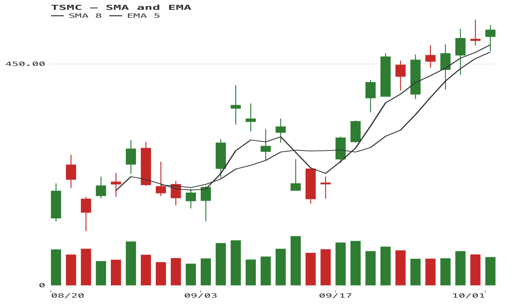
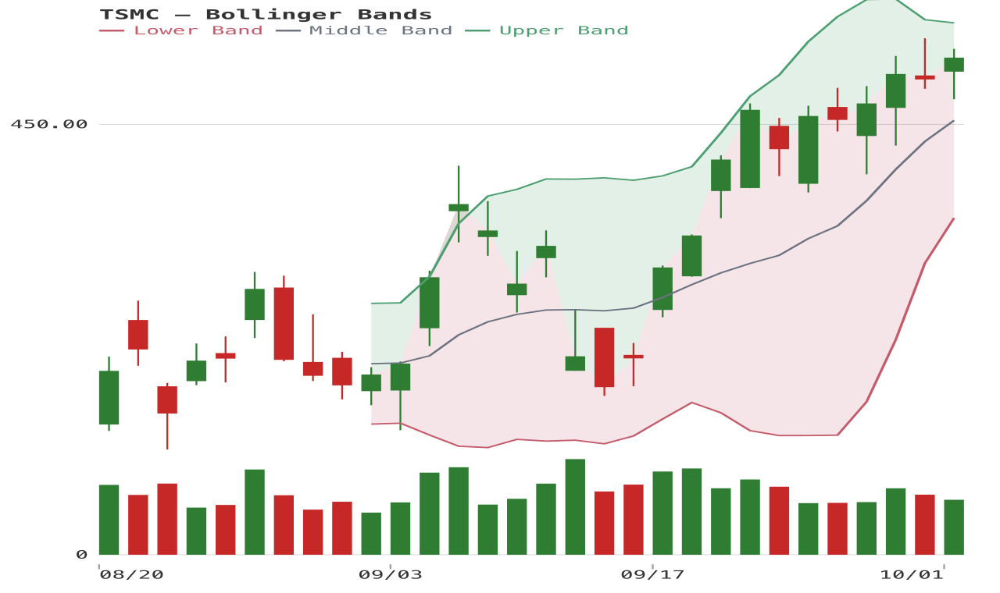
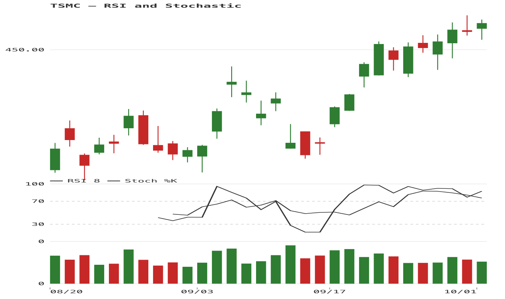
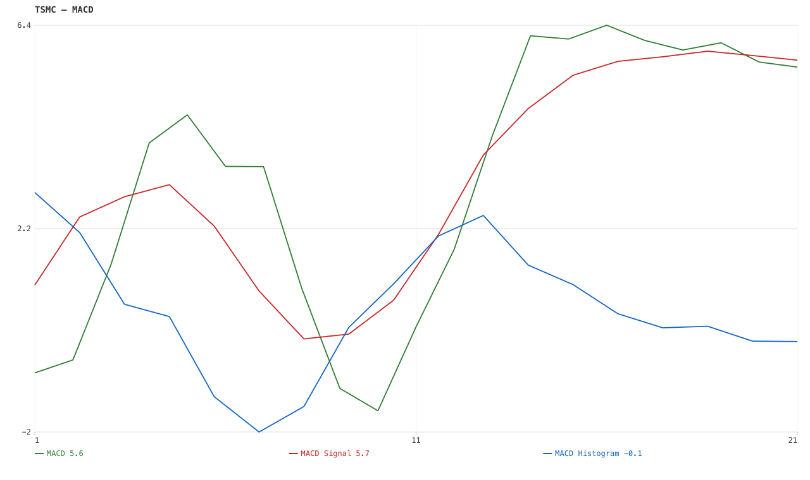
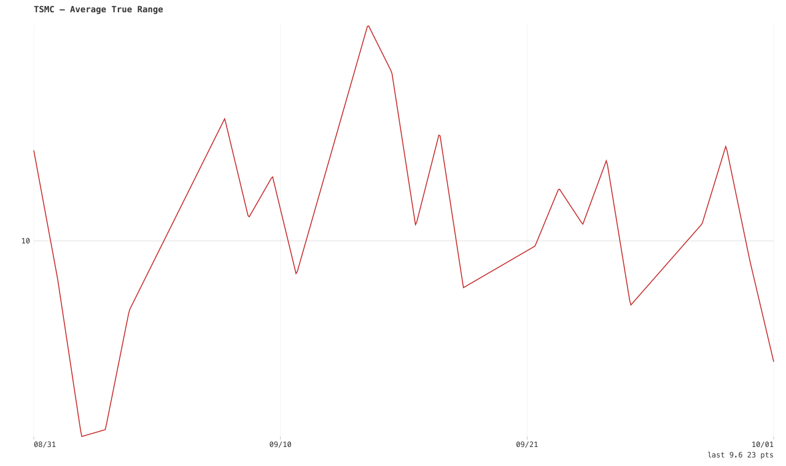
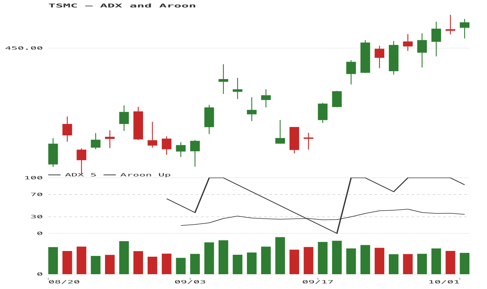
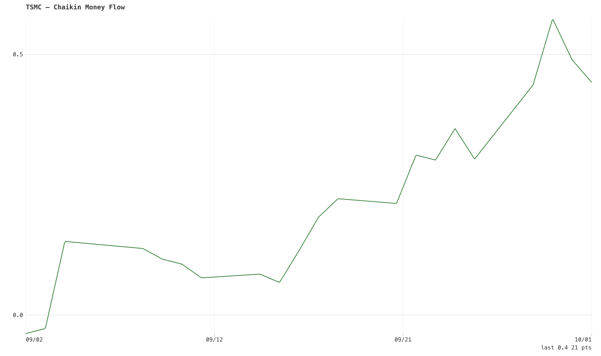
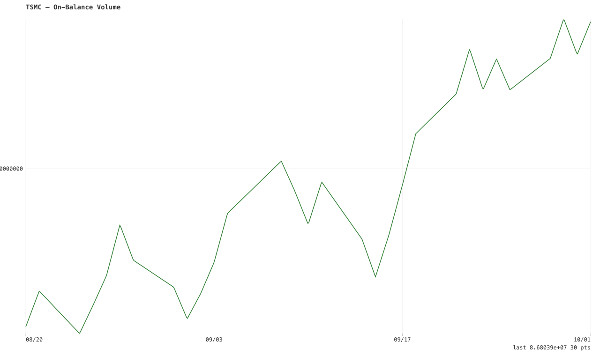

# Indicator examples

All examples use normalized OHLCV bars and the provider-neutral indicator
registry. They are calculated locally in pure Elisp. The screenshots use
30 daily TSMC bars included in [the sample CSV](../examples/tsmc-daily.csv);
they are examples of rendering, not investment recommendations.

Regenerate all eight captures from the repository root:

```sh
emacs -Q --batch -l examples/render-indicator-examples.el
```

The script writes PNGs under `docs/images/indicators/`. Every capture is
produced by this package's SVG/PNG renderers.

## Candlestick overlays

### Moving averages

SMA and EMA are price-scale overlays. Their parameters here use short
windows so the lines are visible in the 30-bar sample.



```elisp
(financial-chart-indicator-evaluate 'sma bars 8)
(financial-chart-indicator-evaluate 'ema bars 5)
```

### Bollinger Bands

The built-in returns named lower, middle, and upper series. The chart API
keeps those outputs aligned to the source bars. The two filled regions
between close and the upper/lower bands use independent configurable colors.



```elisp
(financial-chart-indicator-evaluate 'bollinger-bands bars 10 2)

(setq financial-chart-indicator-bands
      (list (financial-chart-bollinger-band-spec
             20 2 "#4c9f70" "#c45b6a" 0.16)))
```

## Oscillators and momentum

### RSI and Stochastic

Both are bounded 0–100 outputs and can share the chart's oscillator panel.



```elisp
(financial-chart-indicator-evaluate 'rsi bars 8)
(financial-chart-indicator-evaluate 'stochastic bars 8 3)
```

### MACD

MACD returns three aligned outputs: the MACD line, signal line, and
histogram.



```elisp
(financial-chart-indicator-evaluate 'macd bars 5 10 4)
```

## Volatility and range

### Average True Range

ATR is an absolute price-range measure. Its unit follows the input price
unit; it is not a bounded oscillator.



```elisp
(financial-chart-indicator-evaluate 'atr bars 8)
```

## Trend strength

DMI exposes +DI, -DI, and ADX. Aroon returns up and down series. Both
families align their outputs with the input bars and leave warm-up values
as `nil`.



```elisp
(financial-chart-indicator-evaluate 'dmi bars 5)
(financial-chart-indicator-evaluate 'aroon bars 8)
```

## Volume flow

CMF is a rolling ratio; OBV is cumulative signed volume. They use the
volume values as supplied by the data source, so comparisons across
providers should account for each provider's volume conventions.



```elisp
(financial-chart-indicator-evaluate 'chaikin-money-flow bars 10)
```



```elisp
(financial-chart-indicator-evaluate 'obv bars)
```

## External indicator data

Providers and external calculators can use the same normalized-series
contract without adding provider code to the chart package:

```elisp
(setq external-rsi
      (financial-chart-normalize-indicator-series
       '(:name rsi-14 :label "RSI 14" :unit :percent
         :panel :oscillator :values [nil 42.1 55.8])))

(financial-chart-plot-spec
 (financial-chart-indicator-chart-spec external-rsi))
```

Use `financial-chart-list-indicators` to discover registered calculators.
The complete local calculator set includes moving averages, momentum,
oscillators, volatility/range, trend-strength, and volume-flow families.
