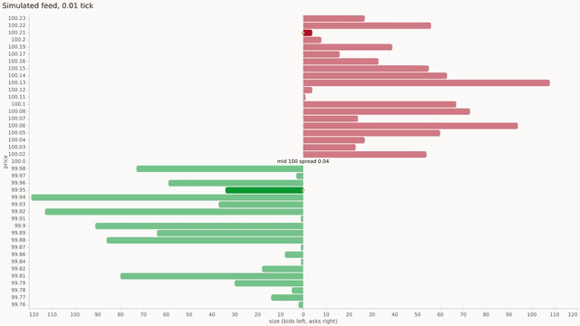

# Videos

Recordings of the animated charts. Each clip is 12 s at 30 fps, as an
MP4 (H.264, 1280x720) for the docs site and a looping 640-wide GIF for
the README.

| Clip | MP4 | GIF | What it shows |
|------|-----|-----|---------------|
| ladder | [ladder.mp4](ladder.mp4) | [ladder.gif](ladder.gif) | The `ladder` template on a live order book |
| depth-live | [depth-live.mp4](depth-live.mp4) | [depth-live.gif](depth-live.gif) | The `depth-live` template on the same feed |
| book-pair | [book-pair.mp4](book-pair.mp4) | [book-pair.gif](book-pair.gif) | Both side by side, one feed |
| book-text | [book-text.mp4](book-text.mp4) | [book-text.gif](book-text.gif) | The ladder in the text (terminal) renderer |
| candles | [candles.mp4](candles.mp4) | [candles.gif](candles.gif) | Candles with SMA 10/30, volume, RSI 14 and MACD as bars stream in |
| candles-text | [candles-text.mp4](candles-text.mp4) | [candles-text.gif](candles-text.gif) | The same chart in the text renderer |



## The feed

The order book clips share one seeded feed
(`financial-chart-video-feed-make`, seed 20261007): a book around 100.00
on a 0.01 tick, 32 levels a side. Each frame applies 0 to 4 random
changes, most of them near the touch: a size random walk (about 72%),
a level inserted in an empty tick (12%), a level deleted (11%), or the
touch taken out with a level refilled far out (5%). While the spread is
wider than 2 ticks most inserts improve the touch, so it stays 1 to 5
ticks wide. The ladder clips draw 20 levels a side (18 in the
terminal). The frames push those deltas with `financial-chart-book-push`, so changed levels flash
for 0.5 s as they do live.

The candle clips start with 60 seeded daily bars. A new bar opens every
15 frames (half a second) and forms over them, visiting its low then its
high before closing, and every indicator is recomputed each frame from
the last 60 bars through `financial-chart-compose-render`.

## How the frames are made

Nothing runs in real time. `src/examples/financial-chart-video.el`
turns eas stream timers off and points `eas-stream-clock` at a virtual
clock set to each frame's timestamp (frame / 30 s), pushes the frame's
deltas, ticks the stream by hand and draws the scene with
`eas-svg-render`. A frame therefore depends only on the seed and its
number, and the video plays at full speed whatever a live frame costs.

Text clips draw with `eas-text-render` (128x45 cells) and
`financial-chart-video-text-svg` lays the result out as an SVG terminal:
one glyph per cell in a monospace font, faces as colours, on a dark
background.

`rsvg-convert` rasterizes the SVG frames to PNG and `ffmpeg` encodes
them: H.264 (`-crf 26`, `yuv420p`, faststart) for the MP4, then the GIF
from the MP4 at 15 fps with one shared 96-colour palette, looping
forever.

## Re-recording

```sh
scripts/record-videos                    # every clip into docs/videos/
scripts/record-videos ladder candles     # just these
EAS=../eas.el scripts/record-videos      # eas.el checkout elsewhere
```

Needs Emacs 30.1+, eas.el (`EAS`, default `../../Personal/emacs/eas.el`)
and curl. Without `ffmpeg` or `rsvg-convert` on `PATH` the script
fetches a static ffmpeg and a conda-forge librsvg (with fonts, through
micromamba) into `/tmp/fc-video-tools` (`TOOLS`); no root needed. Frames
go to `/tmp/fc-videos` (`WORK`), the clips to `docs/videos` (`OUT`).
`JOBS` sets the rasterizer processes (default `nproc`).

The frames are deterministic; the encoded files may differ by encoder
version. Keep each GIF under 5 MB and each MP4 under 8 MB: the script
prints each file's size.
